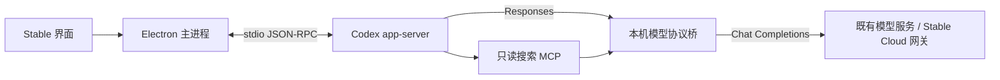

# Stable Codex Harness 接入

分支：`codex-harness-integration`。基于远端 main `6659bd1`（`0.91.7`）整合 `fast-code-drive` 的未提交改动。Codex 固定版本：`0.142.2`。这不是新版本发布。

## 实现范围

Stable 继续提供 Electron 界面、账号、模型目录、额度网关、SQLite 对话记录、附件、Skills 和工作流。Agent 执行入口默认改为开源 Codex 的 `app-server`，使用其线程、工具执行、审批、沙箱和子 Agent 协议。无需登录 Codex 或改变 Stable 的账号体系。



- `desktop/services/execution-harness.cjs`：统一执行入口，默认 Codex；显式设置 `STABLE_HARNESS=deepseek` 可以切回旧实现。失败时不会自动换引擎重做文件操作。
- `codex-harness.cjs`：线程生命周期、进程隔离、历史迁移、审批、事件、图片、取消。
- `codex-builtin-tools.cjs`：将共享浏览器/Excel 工具描述转换为 app-server 动态工具；实际执行仍由 Stable 的 `BuiltinTools` 完成。
- `codex-approval.cjs` / `powershell-approval.ps1`：检查审批命令与文件路径。PowerShell 仅解析语法树，不执行待检查脚本。
- `codex-rpc.cjs`：stdio 请求、响应、通知、超时、退出与进程树清理。
- `codex-responses-bridge.cjs`：Responses 与 Chat Completions 的流式文本、工具、图片和用量转换。
- `codex-reasoning-store.cjs`：按会话保存供应商思考状态，使用 Responses 中的私有引用恢复；普通回答和工具调用均覆盖。
- `codex-search-mcp.cjs`：让 Codex 使用 Stable 的只读搜索路由。
- `scripts/prepare-codex-runtime.cjs`：从固定 npm 版本准备 Windows x64 二进制、rg 和沙箱助手。

## 对话与权限

每个 Stable 对话具有独立的 `userData/codex/sessions/<对话 ID 的 SHA-256>`，不会使用用户个人 Codex Home、账号或配置。第一次接入时把 Stable 当前提供的历史摘要送入新线程，之后恢复线程并只追加本轮上下文。每次运行结束后关闭 app-server，下一轮重新启动并恢复；不会长期驻留空闲进程。

清空或删除 Stable 对话会移除 Codex 线程索引，使下次从新上下文开始。旧 rollout 文件暂留用于诊断；这不是彻底擦除本机所有历史数据的功能。无对话 ID 的后台任务使用临时 Home，并通过已有的防 Junction 跟随清理函数回收。

模型服务密钥保留在主进程。Codex 和搜索 MCP 只获得短期回环代理令牌。模型配置在任务开始时快照，切换模型从下一轮生效。回环接口校验令牌、来源和路径；取消会终止上游模型请求及本次 Codex 进程树。

执行中的“调整方向”通过 `turn/steer` 注入当前 turn，回执必须匹配当前 turn ID。明确拒绝可以重试；回执丢失或超时标为接收状态不确定，沿用主界面的去重机制，避免重复执行。排队、交付校验及全局指令保留 main 的实现。

`stable_excel` 与 `stable_browser` 通过 `thread/start.dynamicTools` 注册，`item/tool/call` 调用主进程工具。浏览器点击、填写、选择保留单次人工审批；只读模式拒绝这些操作，Excel 的路径、另存及只读约束仍由现有服务校验。取消或结束任务会释放工具。未注册这批工具的旧 Codex 线程从 Stable 可见历史迁移，后续恢复包含工具的线程。

普通对话使用 `workspace-write` 和 Codex 的 `untrusted` 审批；保留 Windows unelevated 沙箱与网络限制。Stable 不再把 Codex 用于展示的 `commandActions` 当作风险判定。收到审批后，解析完整 PowerShell 命令结构，核实路径和 Junction 实际目标，再区分三种结果：

- 已核实：读取、搜索、目录筛选，以及工作区内普通文件创建、写入和追加。“完全访问权限”自动批准；“请求审批”保留人工决定。
- 高风险：已识别的删除、清空、系统修改、工作区外写入，或凭据/版本库内部文件访问。保留人工确认。
- 无法核实：动态调用、任意 Node/Python/项目脚本、编码命令、读取可能含密钥的配置文件、路径通配符、网络访问及未提供完整内容的文件变更/权限扩展。完全访问模式仍需人工复核，界面不再将其标为已确认的高风险。

这是自动审批的有限识别范围，并不是通用脚本安全证明。普通开发脚本（包括 npm test/build）如果触发 Codex 审批，也可能需要复核；不能仅凭脚本名称保证其没有破坏性行为。检查只适用于 Codex 发出的审批请求，不能取代其原有沙箱与工具策略。已加载的个人 shell profile 与本机可信运行时也属于执行环境的信任边界。

工作流规划、汇总、指令优化、脚本输入判断、自动审批等不带审批交互的推理调用显式使用只读模式，避免后台任务挂在不可见审批上。新的审批请求读取当前对话权限设置；运行中切换权限不会自动同意此前已经挂起的请求。

## 模型与搜索兼容边界

- 接口保留既有 Chat Completions 模型地址、模型 ID 和凭据；Stable Cloud 继续由原网关鉴权和计费。真实供应商与计费行为仍需联调。
- 纯文本内容块按原顺序合并为字符串，相邻块以空行分隔，兼容云端仅接受字符串的文本校验；工具调用的 assistant/null 保持不变。真实图片仍保留图片数组，云端当前会按原能力限制拒绝，不会通过丢弃图片来绕过限制。该转换同样作用于旧会话重放和上下文压缩请求，无需清空对话。
- DeepSeek 图片输入继续明确拒绝。支持图片的其他模型收到实际图片内容；若 Codex 无法解析附件，协议桥会报错而不静默变成纯文本任务。
- 支持普通函数、命名空间函数和自定义工具的转换。未知托管工具或消息类型显式报错。函数参数需组成有效 JSON 才交给 Codex 执行。
- 每次模型响应的 `reasoning_content` 均写入会话 Home 的 `stable-reasoning.jsonl`，在完成响应前落盘。Responses `encrypted_content` 仅携带随机私有引用，下一次请求、重启恢复及工具调用时由主进程取回原字段；思考原文不进入界面事件或最终回答。状态文件和原有 rollout 一样属于本机私有会话数据，不是加密存储。
- 同一个模型响应中的说明文字和工具调用还原为同一条 assistant 消息，避免拆分后缺失思考字段。未保存思考状态的旧版线程会在下一轮从 Stable 可见历史建立兼容线程，并提醒先检查现有文件；这不会恢复已经丢失的内部状态，也不会清空原文件或对话。
- 搜索通过 MCP 调用本地模型对应的智谱或 DeepSeek 官方搜索接口；不启用 OpenAI 托管搜索。Stable Cloud 当前未提供对应搜索端点，本次没有替云端新增接口。
- 默认上下文窗口为 128000、自动压缩阈值为 90000；这是适配层配置，不代表所有第三方模型都支持该长度。
- 子 Agent 事件保留父子层级；子 Agent 回答不串入主回答。当前最多 3 个并发 Agent 线程；已覆盖协议事件，尚未完成真实模型自主拆分与协作验收。
- Codex 的结构化提问暂转为状态提示，由 Agent 最终用文字提问；没有新增交互式选择题界面。Codex 自身的 Apps、插件安装、电脑操作、浏览器与记忆扩展未启用；Stable 内置后台浏览器通过上述动态工具单独提供。

## 开发与验证

要求 Windows x64、Node.js 22+、npm。当前运行时固定版本，不自动跟随 npm latest。

```powershell
npm ci
npm run tools:install
npm run runtime:codex
npm test
npm run typecheck
npm run test:codex-integration
npm run build
npm start
```

`npm run dev` 只启动 Vite 前端；完整 Agent 需要 Electron。源码运行不依赖个人全局 Codex 安装。`STABLE_CODEX_PATH` 只用于开发时明确指定其他二进制，不应作为发布默认配置。

`test:codex-integration` 启动真实捆绑 Codex，连接本机确定性模拟模型，验证流式文本、重启续聊、思考状态回传、自动上下文压缩、图片、实际文件写入、拒绝越界写入、完全访问下自动读写、高风险/未知操作仍需确认、MCP 搜索、内置 Excel 创建与跨进程重读、执行中调整方向及取消。模拟模型会按 DeepSeek 的要求拒绝思考字段缺失或不匹配的请求；测试命令关闭个人 PowerShell profile，确保只执行夹具命令。不会调用真实模型或消耗账号额度。证据写入被 Git 忽略的 `qa-artifacts/codex-integration/<时间戳>/`。

```powershell
npm run dist:dir
npm run test:codex-packaged
```

打包测试使用安装目录内 `Stable.exe` 的 Electron Node 模式与 `app.asar` 源码，重复同样的集成检查，再运行无界面的更新健康检查。只写独立 QA 数据目录。

## 打包与回退

完整包和轻量更新包均携带 `resources/codex`。旧 DeepSeek Runtime 暂保留在完整包中，并沿用既有 `runtime-v1` 机制供显式回退及原有资源功能使用。轻量更新包复用旧 Runtime，同时携带新的 Codex 目录；不会误把 Codex 从更新包过滤掉。

两类包均单独复制 `vendor/agent-tools/node_modules` 到 `resources/agent-tools/node_modules`。不能只列 `node_modules/**/*` 而漏掉可遍历的父目录，否则实际资源复制会遗漏 ExcelJS；回归测试使用 builder 的真实复制逻辑并实际生成工作簿。

```powershell
$env:STABLE_HARNESS = 'deepseek'
npm start
# 恢复默认 Codex
Remove-Item Env:STABLE_HARNESS
```

旧引擎使用 Stable 数据库里的历史；不会恢复 Codex 独有的内部工具上下文。完整替换验收后再评估移除旧 Runtime，避免此阶段破坏回退路径。

Codex 的 Apache-2.0 LICENSE 与 NOTICE 随安装包置于 `resources/licenses`。上游协议参考：[App Server](https://learn.chatgpt.com/docs/app-server)、[配置说明](https://learn.chatgpt.com/docs/config-file/config-reference)、[开源仓库](https://github.com/openai/codex)。

## 发布前待验收

2026-09-03 云端纯文本兼容修复：188 项测试、类型检查通过。直接使用本地云端校验函数确认旧文本数组触发相同 400、转换后字符串通过。真实 Codex 的文本集成改为经过本机 CloudGatewayProxy 和严格模拟云端校验，14 项检查、21 次请求通过（18 次经过代理），覆盖续聊、工具和自动压缩。源码证据：`qa-artifacts/codex-integration/1788419458223/report.json`。未调用真实线上模型或修改云端部署。

上述修复已更新到本地免安装目录，包内重复 14 项检查、21 次请求（18 次云端代理请求）通过，启动健康检查退出码为 0。最终证据：`qa-artifacts/codex-integration/1788419600080/report.json`。完全退出旧 Stable 后启动修复版即可继续旧对话，真实线上账号仍需复测。

2026-09-03 审批修复：186 项测试、类型检查及生产构建通过，真实 Codex + 模拟模型 13 项集成通过（21 次请求）。源码证据：`qa-artifacts/codex-integration/1788417708294/report.json`。覆盖 full 读取/写入自动批准、request 模式仍询问、高风险拒绝保留原文件以及 unknown 分类。此前一次测试在自动批准搜索后执行超时，未改代码重跑通过；该偶发超时原因仍未知，保留 `1788417593605/trace.json` 供后续排查。

最终本地免安装目录已包含审批修复及 cwd/unknown 边界保护；包内 13 项集成（21 次请求）和无界面健康检查（退出码 0）通过，证据：`qa-artifacts/codex-integration/1788418162250/report.json`。针对性审批测试 4 项复测通过。尚未用真实供应商重新执行截图中的任务。

2026-09-03 续聊修复验证：182 项自动化测试、类型检查通过。真实 Codex + 严格模拟模型的 9 项集成检查通过（13 次请求），包含重启恢复、思考状态回传和真实自动上下文压缩；证据：`qa-artifacts/codex-integration/1788407296906/report.json`。供应商字段要求依据 [DeepSeek 思考模式文档](https://api-docs.deepseek.com/guides/thinking_mode/)；尚未用真实 DeepSeek Key 重新执行用户的任务。

修复已更新到本地免安装目录；打包后同样通过 9 项集成和健康检查（退出码 0），证据为 `qa-artifacts/codex-integration/1788407509093/report.json`。退出旧 Stable 进程并重新启动后，源码与该免安装目录都会加载修复。旧对话的兼容迁移在下一次发送任务时执行。

2026-09-03 本机验证：178 项自动化测试、类型检查、生产构建、完整免安装目录打包通过。源码及打包后运行真实 Codex 对接本机模拟模型的 7 项集成检查通过；包内搜索 MCP 可启动；更新健康检查退出码为 0。最终打包集成证据：`qa-artifacts/codex-integration/1788402932523/report.json`。

真实 DeepSeek / 智谱 / Stable Cloud 的多轮工具调用、流式错误、额度结算；真实图片模型；真实子 Agent 协作；长对话压缩；实际旧设备升级与失败回滚。模拟接口成功不等于这些项目已验收。本分支尚未发布安装器、标签或 GitHub Release。
